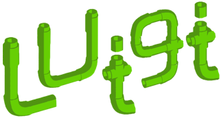
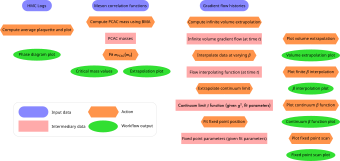

 <!-- .element width="400px" class="fragment" style="margin-right: 100px;" -->
 <!-- .element width="400px" class="fragment" style="margin-left: 100px;" -->

Notes:
Let's say we have some software-reliant process that we want to share with others.
In general,
we would like to split this into two parts:
tools,
that can be re-used in many contexts,
and instructions on how to run these tools in the context of our research.

-

<p style="text-align: center; width: 100%; color: lightgrey; font-family: monospace; margin-bottom: -20px; font-size: 24pt">analysis.sh</p>

```bash title="analysis.sh"
python -m awexomelib.analysis -i input.txt -o output.h5
python -m awexomelib.plot -i output.h5 -o figure.pdf
python -m awexomelib.tabulate -i output.h5 -o table.tex
```

Notes:
Assuming we're writing command-line tools,
there would seem to be a natural choice for sharing recipes of how to run them:
the humble shell script.
This both encodes the steps taken,
and also allows re-running them in exactly the same form.

-

<p style="text-align: center; width: 100%; color: lightgrey; font-family: monospace; margin-bottom: -20px; font-size: 24pt">do-stats.sh</p>

```bash title="do-stats.sh"
# Calculate stats for data files.
for datafile in "$@"
do
    echo $datafile
    bash goostats.sh $datafile stats-$datafile
done
```

Notes:
We encounter this in Software Carpentry:
we have a tool
(goostats)
that computes statistics about goo,
and to both automate the process of running it
and also share with others the exact steps we did,
we can write a short shell script.

-

<p style="text-align: center; width: 100%; color: lightgrey; font-family: monospace; margin-bottom: -20px; font-size: 24pt">analysis_final1.sh</p>

```bash
for filename in ${input_file_set}
do
    ${tool1} "${filename}" -o "$(output_filename ${filename} tool1)"
    ${tool2} "${filename}" -o "$(output_filename ${filename} tool2)"
done

for tool in tool1 tool2
do
    collate_outputs \
      $(for filename in ${input_fileset}; do
          output_filename ${filename} ${tool}
      done | tr '\n' ' ') \
      output_${tool}.h5
done

for plot in ${plots}
do
    python -m ${plot} output_tool{1,2}.h5 --output assets/plots/${plot}.pdf
done

for table in ${tables}
do
    python -m ${table} output_tool{1,2}.h5 --output assets/tables/${table}.tex
done
```

Notes:
In practice,
however,
our analysis is never as simple as one tool like this.
We generally want to process a range of different input files,
and pass the output to other tools,
each step of which may be time consuming.

-


<p style="text-align: center; width: 100%; color: lightgrey; font-family: monospace; margin-bottom: -20px; font-size: 24pt">analysis_cachelib.sh</p>

```bash
is_up_to_date() {
    ...
}

for filename in ${input_file_set}
do
    for tool in tool1 tool2
    do
        if is_up_to_date "$(output_filename ${filename} ${tool})" "${filename}"
        then
            ${${tool}} "${filename}" -o "$(output_filename ${filename} ${tool})"
        fi
    done
done
```


Notes:
If each of these tools takes a long time to execute,
we'd like to avoid recomputing things.
For example,
if the whole process takes an hour to run,
and we update one data file,
we'd rather see the result in a minute rather than wait another hour.
This needs us to implement some kind of cache invalidation in bash.

-

<p style="text-align: center; width: 100%; color: lightgrey; font-family: monospace; margin-bottom: -20px; font-size: 24pt">analysis_parallel_final10_final.sh</p>

```bash
for filename in ${input_file_set}
do
    for tool in tool1 tool2
    do
        if is_up_to_date "$(output_filename ${filename} ${tool})" "${filename}"
        then
            echo ${${tool}} "${filename}" -o "$(output_filename ${filename} ${tool})" \
              >> /tmp/jobfile.sh
        fi
    done
done

parallel {} :::: /tmp/jobfile.sh
rm /tmp/jobfile.sh
```

Notes:
If our workflow takes a while,
we probably want to run it in parallel.
But how do we combine that with our cache invalidation?
And what if we have different loops that benefit from being in parallel?
We need to do some acrobatics here,
and even then,
dealing with cases where later work depends on earlier work
makes it very difficult to maximise utilisation of parallel resources.

-

 <!-- .element height="600px" -->

Notes:
OK,
we just need to add a few more spokes and I'll have invented
a brand new locomotion technology.
No,
we're reinventing the wheel!
This is a problem that many people have encountered and solved before;
we don't _need_ to reimplement our own solution
in a nest of increasingly illegible shell scripts!

---

[ <!-- .element height="150px" style="margin: 40px" -->](https://aiida.net/)
[ <!-- .element height="150px" style="margin: 40px" -->](https://airflow.apache.org)
[ <!-- .element height="150px" style="margin: 40px" -->](https://www.commonwl.org)
[ <!-- .element height="150px" style="margin: 40px" -->](https://cylc.github.io)

[ <!-- .element height="150px" style="margin: 40px" -->](https://dagster.io)
[ <!-- .element height="150px" style="margin: 40px" -->](https://joblib.readthedocs.io/en/stable/)
[ <!-- .element height="150px" style="margin: 40px" -->](https://github.com/spotify/luigi)
[ <!-- .element height="150px" style="margin: 40px" -->](https://metaflow.org)

[ <!-- .element height="150px" style="margin: 40px" -->](https://nextflow.io)
[ <!-- .element height="150px" style="margin: 40px" -->](https://parsl-project.org)
[ <!-- .element height="150px" style="margin: 40px" -->](https://snakemake.readthedocs.io/en/stable/)
[ <!-- .element height="150px" style="margin: 40px" -->](https://taskfile.dev/)

Notes:
Indeed,
we have stumbled across a discipline called "workflow manager";
this is just a handful of the most popular workflow managers.
Many,
many people have tried to solve the problem of
"reproducibly run a sequence of steps";
we just need to pick a well-maintained project that meets our needs!

-

 <!-- .element height="600px" -->

Notes:
In general,
we would like our workflow manager to let us easily define units of work
and the relationships between them,
and automate scheduling this work.
In particular,
being able to partially re-run workflows where input data have changed,
and automatically parallelise independent parts of the workflow,
are features we'd like to have.
For data analysis workflows,
it's common for workflow managers to create a directed acyclic graph
(DAG)
from the set of rules.
If you've used Make
(for example,
to build executables from source code),
Make is an early example of many of the principles of workflow management.
You can use Make to automate a data analysis workflow,
but there are now tools that are rather more ergonomic for this.

-

[ <!-- .element height="350px" style="margin: 40px" -->](https://snakemake.readthedocs.io/en/stable/)

Notes:
Snakemake is the tool that our collaboration found to be the best fit for our work,
and the one I'm going to demo today.

---

# Demo

Based on data and code at
[doi:10.5281/zenodo.17308706](https://doi.org/10.5281/zenodo.17308706)

[Follow the shell session: bit.ly/rsecon26-snakemake](https://asciinema.org/s/KKcvrQQ3unm5q6Vk)

-

<p style="text-align: center; width: 100%; color: lightgrey; font-family: monospace; margin-bottom: -20px; font-size: 24pt">workflow/Snakefile</p>

```snakemake
rule count_lines:
    input: "raw_data/beta2.0/out_pg"
    output: "intermediary_data/beta2.0/pg.count"
    shell:
        "wc -l raw_data/beta2.0/out_pg > intermediary_data/beta2.0/pg.count"

```

 <!-- .element height="32px" style="margin-bottom: -18px" -->

```shellsession
snakemake --cores 1 intermediary_data/beta2.0/pg.count
```

Notes:
Snakemake defines workflows at top level in a file called `Snakefile`,
which derives its name from Make's `Makefile`.
The syntax is an extension of Python;
at top level,
we introduce a `rule:` block.
Each rule defines how one or more input files
translates to one or more output files.
Underneath this,
we specifically list the `input:` and `output:` files,
and the `shell:` command to run to perform the desired operation.
To run,
we specify the available compute resources
and what output file we want to produce.
Re-running the command is a no-op,
since Snakemake recognises that
the inputs haven't changed since the output was last produced.

-

<p style="text-align: center; width: 100%; color: lightgrey; font-family: monospace; margin-bottom: -20px; font-size: 24pt">workflow/envs/analysis.yml</p>

```yaml
name: su2pg_analysis
channels:
  - conda-forge
dependencies:
  - pip=24.2
  - python=3.12.6
  - pip:
      - h5py==3.11.0
      - jinja2==3.1.6
      - matplotlib==3.9.2
      - numpy==2.1.1
      - pandas==2.2.3
      - scipy==1.14.1
      - uncertainties==3.2.2
      - corrfitter==8.2
      - -e ../../libs/su2pg_analysis
```

Notes:
For reproducibility,
it's important to have a well-defined environment in which to run a workflow rule.
Snakemake can manage this for us:
if we provide a Conda environment definition file,
Snakemake will instantiate it,
reuse it on subsequent executions if the definition doesn't change,
and reinstantiate it if it does.

-

<p style="text-align: center; width: 100%; color: lightgrey; font-family: monospace; margin-bottom: -20px; font-size: 24pt">workflow/Snakefile</p>

```snakemake
rule avg_plaquette:
    input: "raw_data/beta2.0/out_pg"
    output: "intermediary_data/beta2.0/pg.plaquette.json.gz"
    conda: "envs/analysis.yml"
    shell:
        "python -m su2pg_analysis.plaquette raw_data/beta2.0/out_pg --output_file intermediary_data/beta2.0/pg.plaquette.json.gz"
```

 <!-- .element height="32px" style="margin-bottom: -18px" -->

```shellsession
snakemake --cores 1 --software-deployment-method=conda intermediary_data/beta2.0/pg.plaquette.json.gz
```

Notes:
Let's define another rule that makes use of the environment we've defined.
To specify which environment to use for a rule,
we add the `conda:` block to the rule definition.
We also need to add the `--software-deployment-method=conda` option
in order to tell Snakemake to observe the `conda:` directives.
Snakemake can also use Apptainer or environment modules
as its software deployment method;
other methods are under development.

-

<p style="text-align: center; width: 100%; color: lightgrey; font-family: monospace; margin-bottom: -20px; font-size: 24pt">workflow/Snakefile</p>

```snakemake
rule avg_plaquette:
    input: "raw_data/{subdir}/out_pg"
    output: "intermediary_data/{subdir}/pg.plaquette.json.gz"
    conda: "envs/analysis.yml"
    shell:
        "python -m su2pg_analysis.plaquette {input} --output_file {output}"
```

 <!-- .element height="32px" style="margin-bottom: -18px" -->

```shellsession
snakemake --cores 1 --software-deployment-method=conda \
    intermediary_data/beta2.0/pg.plaquette.json.gz \
    intermediary_data/beta2.2/pg.plaquette.json.gz
```

Notes:
We had a lot of repetition in the previous example.
In particular,
if we wanted to use the same script
for multiple different input and corresponding output files,
then it would be awkward to make multiple copies.
Snakemake gives us a few tools to help with this:
firstly,
we can use _wildcards_,
such as `{subdir}` here,
to match any arbitrary substring.
Secondly,
we can use _placeholders_
to put variables from the rule definition in the shell command.
This lets us not only reproduce the previous rule,
the results of which are cached,
but also generalise to other input files.

-


<p style="text-align: center; width: 100%; color: lightgrey; font-family: monospace; margin-bottom: -20px; font-size: 24pt">workflow/Snakefile</p>

```snakemake
rule plot_avg_plaquette:
    input:
        expand(
            "intermediary_data/beta{beta}/pg.plaquette.json.gz",
            beta=[1.5, 1.6, 1.7, 1.8, 1.9, 2.0, 2.1, 2.2, 2.3, 2.4, 2.5],
        ),
    output:
        "assets/plots/plaquette_scan.pdf"
    conda: "envs/analysis.yml"
    shell:
        "python src/plot_plaquette.py {input} --output_filename {output}"
```

 <!-- .element height="32px" style="margin-bottom: -18px" -->

```shellsession
snakemake --cores 6 --software-deployment-method=conda assets/plots/plaquette_scan.pdf
```

Notes:
We aren't limited to a single input file:
we can have a rule that combines multiple input files
to generate output depending on all of them.
`expand()` here is a Snakemake helper function,
giving a lit of files with the `{beta}` wildcard filled in.
Snakemake works out that this depends on files that aren't created yet,
and identifies which rules to run,
and with which wildcards,
to get these files ready.
Because we give it six cores to play with,
it identifies that it can run many of these rules in parallel,
so we get the result more quickly than if we had to loop them one after another.

-

<p style="text-align: center; width: 100%; color: lightgrey; font-family: monospace; margin-bottom: -20px; font-size: 24pt">config/config.yaml</p>

```yaml
W0_reference: 0.2
metadata: metadata/ensemble_metadata.csv
```


<p style="text-align: center; width: 100%; color: lightgrey; font-family: monospace; margin-bottom: -20px; font-size: 24pt">workflow/Snakefile</p>

```snakemake
configfile: "config/config.yaml"

...

rule w0:
    input: "raw_data/{subdir}/out_wflow"
    output: "intermediary_data/{subdir}/wflow.w0.json.gz"
    conda: "envs/analysis.yml"
    shell:
        "python -m su2pg_analysis.w0 {input} --W0 {config[W0_reference]} --output_file {output}"
```

 <!-- .element height="32px" style="margin-bottom: -18px" -->

```shellsession
snakemake --cores 6 --software-deployment-method=conda intermediary_data/beta2.0/wflow.w0.json.gz
```

Notes:
We can also make our workflows configurable,
in an easily reproducible way,
by depending on parameters set in a configuration YAML file.

-

<p style="text-align: center; width: 100%; color: lightgrey; font-family: monospace; margin-bottom: -20px; font-size: 24pt">workflow/Snakefile</p>

```snakemake
import pandas

metadata = pandas.read_csv(config["metadata"])

...

rule ps_mass:
    input: "raw_data/beta{beta}/out_corr"
    output: "intermediary_data/beta{beta}/corr.ps_mass.json.gz"
    params:
        plateau_start=lookup(within=metadata, query="beta == {beta}", cols="ps_plateau_start"),
        plateau_end=lookup(within=metadata, query="beta == {beta}", cols="ps_plateau_end"),
    conda: "envs/analysis.yml"
    shell:
        "python -m su2pg_analysis.meson_mass {input} --output_file {output} --plateau_start {params.plateau_start} --plateau_end {params.plateau_end}"
```

 <!-- .element height="32px" style="margin-bottom: -18px" -->

```shellsession
snakemake --cores 6 --software-deployment-method=conda intermediary_data/beta2.0/corr.ps_mass.json.gz
```

Notes:
We may also want to have metadata for specific files in our dataset.
Since Snakemake builds on Python,
we can use a standard Python import to get access to Pandas,
and read a metadata file.
The `lookup` function is a helper to pull out relevant data from a dataframe.
The `params` block defines parameters to the rule that aren't files;
Snakemake knows to re-run the rule if these change,
but doesn't check the disk for them.

-

<p style="text-align: center; width: 100%; color: lightgrey; font-family: monospace; margin-bottom: -20px; font-size: 24pt">workflow/Snakefile</p>

```snakemake
# We now need to use consistent wildcards in this rule with those below
rule avg_plaquette:
    input: "raw_data/beta{beta}/out_pg"
    output: "intermediary_data/beta{beta}/pg.plaquette.json.gz"
    conda: "envs/analysis.yml"
    shell:
        "python -m su2pg_analysis.plaquette {input} --output_file {output}"

...

rule one_loop_matching:
    input:
        plaquette=rules.avg_plaquette.output,
        meson=rules.ps_mass.output,
    output:
        data="intermediary_data/beta{beta}/pg.corr.ps_decay_const.json.gz",
    conda: "envs/analysis.yml"
    shell:
        "python -m su2pg_analysis.one_loop_matching --plaquette_data {input.plaquette} --spectral_observable_data {input.meson} --output_filename {output.data}"
```

 <!-- .element height="32px" style="margin-bottom: -18px" -->

```shellsession
snakemake --cores 6 --software-deployment-method=conda intermediary_data/beta2.0/corr.ps_decay_const.json.gz
```

Notes:
We can also define rules that depend on multiple other rules.
If the wildcards are compatible,
it's easier to do this by referring to the rule by name,
rather than repeating the full path each time.
We can also give names to inputs and outputs
to make it easier to refer to subsets
when multiple files are specified.

-

<p style="text-align: center; width: 100%; color: lightgrey; font-family: monospace; margin-bottom: -20px; font-size: 24pt">workflow/Snakefile</p>

```snakemake
rule spectrum:
    input:
        script="src/plot_spectrum.py",
        ps_mass=expand(
            "intermediary_data/beta{beta}/corr.ps_mass.json.gz",
            beta=metadata.beta,
        ),
        ps_decay_const=expand(
            "intermediary_data/beta{beta}/pg.corr.ps_decay_const.json.gz",
            beta=metadata.beta,
        ),
    output:
        plot="assets/plots/spectrum.pdf",
    conda: "envs/analysis.yml"
    default_target: True
    shell:
        "python {input.script} {input.ps_mass} {input.ps_decay_const} --y_observable f_ps --zero_y_axis --zero_x_axis --output_file {output.plot}"
```

 <!-- .element height="32px" style="margin-bottom: -18px" -->

```shellsession
snakemake --cores 6 --software-deployment-method=conda
```

Notes:
We can combine the output of all of these rules.
Specifying `default_target` tells Snakemake
to run this rule if no target is specified at the command line.
Similarly to `Make`,
another way to achieve this is to put the rule first in the Snakefile.

-

 <!-- .element height="32px" style="margin-bottom: -18px" -->

```shellsession
snakemake --forceall --dag dot assets/plots/spectrum.pdf | dot -Tpdf -odag.pdf
open dag.pdf
```

Notes:
We can get Snakemake to visualise our whole workflow for us.

-

 <!-- .element height="32px" style="margin-bottom: -18px" -->

```shellsession
snakemake --conda-create-envs-only
```

<p style="text-align: center; width: 100%; color: lightgrey; font-family: monospace; margin-bottom: -20px; font-size: 24pt">submit_snakemake.sh</p>

```bash
#!/bin/bash
#SBATCH --nodes=1
#SBATCH --exclusive

module load snakemake

snakemake --cores all --software-deployment-method=conda
```

 <!-- .element height="32px" style="margin-bottom: -18px" -->

```shellsession
sbatch submit_snakemake.sh
```

Notes:
If our workflows require more resources than we have locally,
we can run on a cluster.
One way to do this is to write a job script.
Since many clusters don't allow Internet access from compute nodes,
we can instantiate the Conda environments from the login node in advance.
This lets us use an entire node,
but means we have the same resources available throughout the job:
if there are long serial sections,
we'll waste resources.

-

<p style="text-align: center; width: 100%; color: lightgrey; font-family: monospace; margin-bottom: -20px; font-size: 24pt">~/.config/snakemake/my-cluster/profile.yaml</p>

```yaml
executor: slurm
jobs: 30
cores: 1080
software-deployment-method: conda
default-resources:
  mem_mb: 4096
  slurm_account: my-project
```

 <!-- .element height="32px" style="margin-bottom: -18px" -->

```shellsession
pip install snakemake-executor-plugin-slurm
snakemake --profile my-cluster
```

Notes:
Alternatively,
we can use the Slurm executor plugin for Snakemake
to have Snakemake submit jobs for each step in the workflow.
This avoids wasting resources,
and can be much faster if there is are highly parallel sections to the workflow,
but requires a long-running process on the login node
while waiting for jobs to execute,
or having jobs that submit other jobs.
Some HPC centers object to one or both of these,
so speak proactively with your sysadmins to avoid causing disruption.
